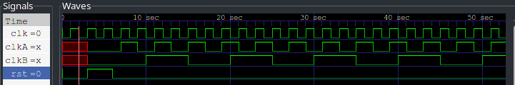

---
output:
  pdf_document:
    pandoc_args: [
      "--template=/usr/share/pandoc/data/templates/pm-template.latex"
    ]
export_on_save:
    pandoc: true
---

# 分频器

## 设计思路

设计的核心是采用计数器进行计数，从而最终完成每特定周期进行一次反转。但是对于奇数、偶数的分频器，计数方式略有不同。对于偶数分频器，只需要对特定沿进行计数，若是进行 2 n 分频，那么新波形的高占据了 n 个原时钟信号的周期。若是进行 2n + 1 分频，那么需要进行两个沿的计数，新的波形的高占据了 2n + 1 个半周期。

由于时序信号需要存储元件，因此必须有复位信号完成存储元件的初始化。而作业文件中未明确这一点，因此用高电平复位信号暂代。

## 测试流程

输入是一个时钟信号，通过 `always` 进行生成，和一个高电平复位信号。结果如[分频波形图](wave.png)

