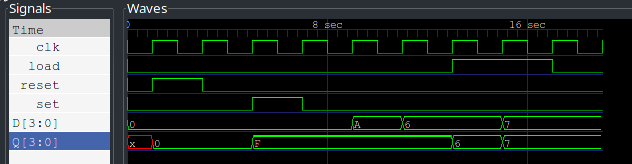

---
output:
  pdf_document:
    pandoc_args: [
      "--template=/usr/share/pandoc/data/templates/pm-template.latex"
    ]
export_on_save:
    pandoc: true
---

# 同步SRL寄存器

## 设计思路

信号的优先级可用 `if-else` 实现。

## 测试流程

输入是一个时钟信号，通过 `always` 进行生成，以及相关的控制信号。分别测试 `set` ， `reset` ，在 `load` 未使能时测试输入的改变，以及使能之后的表现。结果如[波形图](wave.png)

