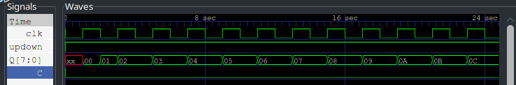
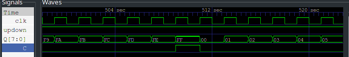
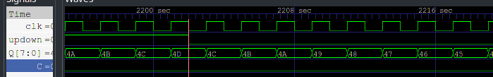
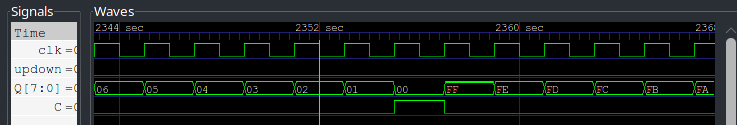

---
output:
  pdf_document:
    pandoc_args: [
      "--template=/usr/share/pandoc/data/templates/pm-template.latex"
    ]
export_on_save:
    pandoc: true
---

# 二进制加减计数器

## 设计思路

对模式使用 `case` 语句，选择工作模式。在即将溢出时发送 `full` 信号到 `C` 。

## 测试流程

输入是一个时钟信号，通过 `always` 进行生成，和一个低电平异步复位信号，以及模式选择信号。
<!-- 结果如[计数器波形图](wave.png) -->

 
 
 
 