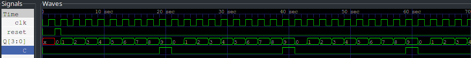

---
output:
  pdf_document:
    pandoc_args: [
      "--template=/usr/share/pandoc/data/templates/pm-template.latex"
    ]
export_on_save:
    pandoc: true
---

# 十进制计数器

## 设计思路

对时钟计数，输出当前计数和进位，参考 74190 的文档，在计数到 9 后输出进位并且归 0 ，因此在进入到计数 8 时需要对进位使能。

## 测试流程

输入是一个时钟信号，通过 `always` 进行生成，和一个高电平复位信号。结果如[计数器波形图](wave.png)

